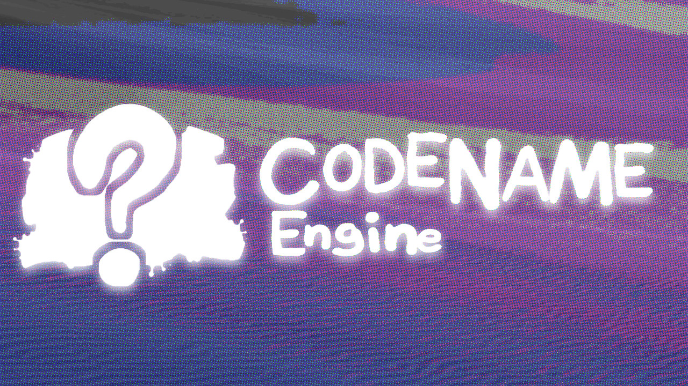

# UNDERTALE MIX - Mobile Port Build

**Pure touch port.**

# ENGINE???
This mod is made on a extensible modding framework for FNF: Codename Engine. This source code folder can be placed in the mods folder to be played in codename!

Download Codename:
- Windows: [https://tinyurl.com/cne-download-windows](https://nightly.link/CodenameCrew/CodenameEngine/workflows/windows/main/Codename%20Engine.zip)
- Mac OS: [https://tinyurl.com/cne-download-macos](https://nightly.link/CodenameCrew/CodenameEngine/workflows/macos/main/Codename%20Engine.zip)
- Linux: [https://tinyurl.com/cne-download-linux](https://nightly.link/CodenameCrew/CodenameEngine/workflows/linux/main/Codename%20Engine.zip)

Codename's Github: [https://github.com/CodenameCrew/CodenameEngine](https://github.com/CodenameCrew/CodenameEngine)

Little note, dustin builds on gamejolt come with a exe built in!!